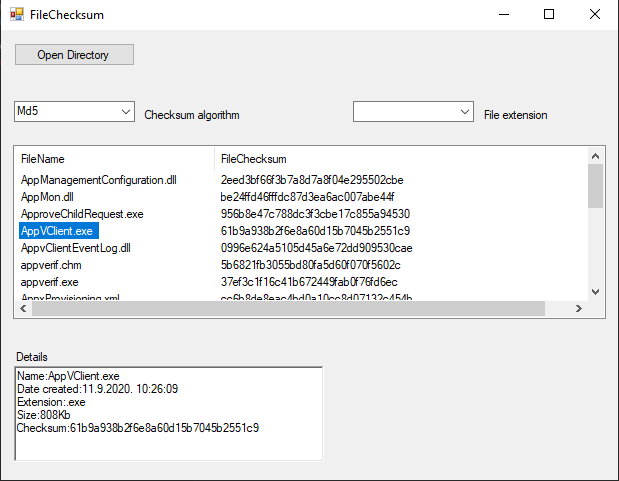

# A simple volume level calculator for petroleum products in tanks

the program is designed to facilitate fuel volume calculations when measuring its level in tanks.
The program also automates the calculation of the correction for temperature changes.

## Instructions

simply enter known parameters such as measured level in centimeters, temperature and the amount of fuel that needs to be drained into the tank. Pressing the enter software returns the amount of fuel in liters, the correction to the measured temperature and the final level in centimeters as well as the available volume in the tank.

## Installing

1. copy the KalkulatorZapremine.exe and the TabliceRezervoara folder to your desktop.
2. Run KalkulatorZapremine.exe